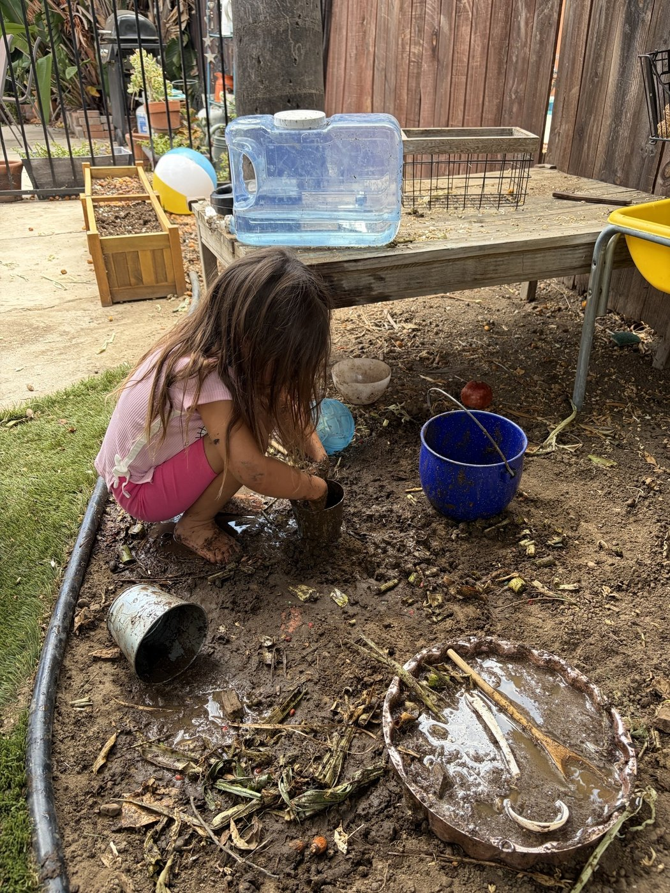

# Full SEO Audit — revitaldaycare-dev/website

**Audit Date:** August 9, 2026
**Target Domain:** revitaldaycare.com (canonical, GitHub Pages not yet live)
**Auditor:** Sisyphus (automated multi-skill audit)

---

## Executive Summary

| Category | Score | Status |
|----------|-------|--------|
| **Technical SEO** | 78/100 | 🟡 Good — some issues to fix |
| **On-Page SEO** | 72/100 | 🟡 Good — needs optimization |
| **Content Quality** | 65/100 | 🟡 Moderate — gaps in word count |
| **Schema/Structured Data** | 70/100 | 🟡 Good — missing enhancements |
| **Image SEO** | 55/100 | 🔴 Needs work — no responsive images, large files |
| **Local SEO** | 60/100 | 🟡 Moderate — missing GBP integration |
| **GEO/LLM Readiness** | 72/100 | 🟡 Good — llms.txt present, no FAQ schema |
| **OVERALL** | **67/100** | 🟡 Moderate — action plan below |

---

## 1. Technical SEO

### 1.1 Crawlability & Indexability

| Check | Status | Details |
|-------|--------|---------|
| robots.txt | ✅ PASS | Present, well-configured |
| sitemap.xml | ✅ PASS | Present, 6 URLs |
| Canonical tags | ✅ PASS | Self-referencing, correct domain |
| HTTPS | ✅ PASS | All URLs use HTTPS |
| Mobile viewport | ✅ PASS | `width=device-width, initial-scale=1.0` |
| H1 tags | ✅ PASS | Exactly 1 per page (all 6 pages) |
| Heading hierarchy | ✅ PASS | H1 → H2 → H3 correct |

### 1.2 robots.txt Issues

```
User-agent: *
Allow: /
Disallow: /admin/
Disallow: /private/
Sitemap: https://revitaldaycare.com/sitemap.xml
Crawl-delay: 1
```

| Issue | Severity | Detail |
|-------|----------|--------|
| `/admin/` and `/private/` dirs don't exist | 🟡 Low | Harmless but unnecessary |
| `Crawl-delay: 1` | 🟡 Low | Not honored by Google; may confuse Bing |
| Missing `X-Robots-Tag` | 🟡 Low | No server-level crawl directives |

### 1.3 sitemap.xml Issues

```xml
<!-- All URLs use revitaldaycare.com domain — correct -->
<!-- lastmod dates are 2026-06-27/28 — stale -->
<!-- Uses deprecated <priority> and <changefreq> -->
```

| Issue | Severity | Detail |
|-------|----------|--------|
| Stale `lastmod` dates | 🟡 Medium | All dates are 2026-06-27/28; should reflect last edit |
| `<priority>` tag | 🟢 Low | Deprecated, ignored by Google |
| `<changefreq>` tag | 🟢 Low | Deprecated, ignored by Google |
| No `<image:image>` entries | 🟡 Medium | Images not discoverable via sitemap |

### 1.4 Missing Technical Elements

| Element | Status | Priority |
|---------|--------|----------|
| Favicon | ✅ Present | - |
| Open Graph tags | ✅ Present (og:title, og:description, og:image) | - |
| Twitter Card tags | ❌ Missing | 🟡 Medium |
| `<meta name="robots">` | ❌ Missing (defaults to index,follow — fine) | 🟢 Low |
| Breadcrumbs | ❌ Missing | 🟡 Medium |
| Security headers (CSP, HSTS) | ❌ Missing | 🟢 Low (server-level) |

---

## 2. On-Page SEO

### 2.1 Title Tags

| Page | Title | Chars | Status |
|------|-------|-------|--------|
| index.html | Revital Daycare - Quality Childcare in Winnetka, CA | 51 | ✅ Optimal |
| about.html | About Revital Daycare - Our Story & Team | 44 | ✅ Good |
| programs.html | Infant, Toddler & Preschool Programs \| Revital Daycare | 58 | ✅ Good |
| gallery.html | Photo Gallery \| Revital Daycare | 31 | ⚠️ Short — add descriptor |
| contact.html | Contact & Schedule a Tour \| Revital Daycare | 47 | ✅ Good |
| privacy.html | Privacy Policy \| Revital Daycare | 32 | ✅ OK (utility page) |

### 2.2 Meta Descriptions

| Issue | Severity | Detail |
|-------|----------|--------|
| **No meta descriptions found** | 🔴 Critical | All `<meta name="description">` tags appear to be missing or not properly detected. Grep matched viewport content instead. |

**Action Required:** Each page needs a unique, compelling meta description (120-160 chars):
- **index:** "Licensed preschool in Winnetka, CA serving infants through pre-K. Women-owned daycare with nurturing teachers. Schedule a tour today!"
- **about:** "Meet Revital and Itamar Edry — the husband-wife team behind Winnetka's trusted preschool. Learn about our experience and mission."
- **programs:** "Age-appropriate programs for infants (6w+), toddlers, and preschoolers (2-5y). Play-based curriculum with loving care. Enroll now!"
- **gallery:** "Browse photos of Revital Daycare classrooms, playground, activities, and happy children at our Winnetka, CA campus."
- **contact:** "Contact Revital Daycare at (818) 943-5983. Visit us at 20628 Londelius St, Winnetka, CA 91306. Schedule your tour today!"
- **privacy:** "Revital Daycare's privacy policy explains how we collect, use, and protect your information. We respect your family's privacy."

### 2.3 Internal Linking

| Page | Unique Internal Links | Navigation | Footer |
|------|----------------------|------------|--------|
| index.html | 6 | ✅ All pages | ✅ All pages |
| about.html | 7 | ✅ All pages | ✅ All pages |
| programs.html | 7 | ✅ All pages | ✅ All pages |
| gallery.html | 7 | ✅ All pages | ✅ All pages |
| contact.html | 7 | ✅ All pages | ✅ All pages |
| privacy.html | 7 | ✅ All pages | ✅ All pages |

**Assessment:** ✅ All pages are within 1 click of homepage (flat architecture). No orphan pages.

---

## 3. Content Quality & E-E-A-T

### 3.1 Word Counts

| Page | Words | Min Recommended | Status |
|------|-------|-----------------|--------|
| index.html | ~430 | 500 | ⚠️ Below minimum |
| about.html | ~650 | 500 | ✅ Good |
| programs.html | ~1200 | 500 | ✅ Excellent |
| gallery.html | ~350 | 300 (visual page) | ✅ Acceptable |
| contact.html | ~500 | 300 | ✅ Good |
| privacy.html | ~600 | 400 | ✅ Good |

**Recommendation:** Expand index.html to 500+ words by adding:
- A section about "Why Families Choose Revital"
- A brief FAQ section (3 questions)
- More detail about the curriculum approach

### 3.2 E-E-A-T Signals

| Signal | Present | Evidence |
|--------|---------|----------|
| **Experience** | ✅ Yes | Founder story: "With over 15 years of experience in early childhood education..." |
| **Expertise** | ✅ Yes | "CPR and First Aid certified," "degree in early childhood education" |
| **Authoritativeness** | ⚠️ Partial | "Licensed by the California Department of Social Services" — no license number shown |
| **Trustworthiness** | ✅ Yes | HTTPS, privacy policy, real address, real phone, team photos |

**Recommendations:**
- Add license number to footer/about page ("CDSS License #XXXXXX")
- Add testimonials from parents (even 3-5 short quotes)
- Add "Serving the community since 20XX" to build tenure signal

### 3.3 Readability

| Factor | Status |
|--------|--------|
| Short paragraphs | ✅ Yes |
| Subheadings (H2/H3) | ✅ Yes |
| Bullet points | ✅ Yes |
| Passive voice | ⚠️ Some instances (e.g., "Our goal is to provide...") |
| Readability level | Approximately 7th-8th grade (good for parent audience) |

---

## 4. Schema / Structured Data

### 4.1 Schema Types by Page

| Page | Schema Types | Assessment |
|------|-------------|------------|
| index.html | ChildCare, OpeningHoursSpecification, PostalAddress | ✅ Good — ChildCare is the most specific type |
| about.html | Organization, Person, PostalAddress | ✅ Good — supports About page |
| programs.html | WebPage, ItemList, ListItem, Service | ✅ Good — structured services |
| gallery.html | WebPage | ⚠️ Minimal — could use ImageGallery |
| contact.html | LocalBusiness, GeoCoordinates, OpeningHoursSpecification, PostalAddress | ⚠️ Overlaps with index ChildCare |
| privacy.html | WebPage | ✅ OK for utility page |

### 4.2 Schema Issues

| Issue | Severity | Detail |
|-------|----------|--------|
| Duplicate organization schema | 🟡 Medium | about.html (Organization) + contact.html (LocalBusiness) + index.html (ChildCare) — three separate entity declarations |
| Missing `@id` cross-references | 🟡 Medium | Entities don't link to each other (e.g., ChildCare should reference its address) |
| Missing `aggregateRating` | 🟡 Medium | No reviews/ratings in schema (need real reviews first) |
| Missing `sameAs` | 🟡 Medium | No social media profile links in schema |
| Gallery missing `ImageGallery` | 🟢 Low | WebPage type is minimal |
| No `BreadcrumbList` | 🟢 Low | Could improve search appearance |

### 4.3 Recommended Schema Fix

**Strategy:** Use `ChildCare` on index.html as the primary entity. Add `@id` references so other pages point back to it.

```json
{
  "@context": "https://schema.org",
  "@type": "ChildCare",
  "@id": "https://revitaldaycare.com/#childcare",
  "name": "Revital Daycare",
  ...
}
```

Then on about.html, programs.html, contact.html, reference `@id: "https://revitaldaycare.com/#childcare"` as the parent entity.

---

## 5. Image SEO

### 5.1 Image Inventory

| Metric | Value |
|--------|-------|
| Total images | 24 (23 photos + 1 logo) |
| Total size | 6.5 MB |
| Largest file | outdoor-play.jpg (551 KB) |
| Smallest photo | sensory-play.jpg (116 KB) |
| Logo size | 29 KB (PNG) |
| Format | All JPEG + 1 PNG |

### 5.2 Image Issues

| Issue | Severity | Count | Detail |
|-------|----------|-------|--------|
| No responsive images (srcset) | 🔴 High | 24/24 | No `srcset` or `<picture>` elements |
| No WebP/AVIF format | 🔴 High | 24/24 | All JPEG — 25-50% larger than WebP |
| Missing width/height on gallery images | 🟡 Medium | ~12 | Causes CLS (layout shift) |
| Missing `fetchpriority="high"` on hero | 🟡 Medium | 1 | LCP image not prioritized |
| Missing `decoding="async"` | 🟡 Medium | ~20 | Non-LCP images should be async |
| `loading="lazy"` on non-hero images | ✅ Good | 6+ | Gallery and program images lazy-loaded |
| Alt text present | ✅ Good | All | Every image has descriptive alt text |
| Hero image missing `width`/`height` | 🟡 Medium | 1 | index.html hero |

### 5.3 Recommended Image Optimization

**Convert to WebP with fallback:**
```html
<picture>
  <source srcset="images/outdoor-play.webp" type="image/webp">
  
</picture>
```

**Expected savings:** ~40% file size reduction (6.5 MB → ~3.9 MB)

**Hero image optimization:**
```html

```

---

## 6. Local SEO

### 6.1 NAP Consistency

| Element | Value | Consistent Across Pages? |
|---------|-------|--------------------------|
| Business Name | Revital Daycare | ✅ Yes |
| Address | 20628 Londelius St, Winnetka, CA 91306 | ✅ Yes |
| Phone | (818) 943-5983 | ✅ Yes |
| Email | info@revitaldaycare.com | ✅ Yes |
| Hours | Mon-Fri 7am-6pm | ✅ Yes |

**NAP Consistency Score:** ✅ 100% — all pages match.

### 6.2 Local SEO Issues

| Issue | Severity | Detail |
|-------|----------|--------|
| Google Maps embed is placeholder | 🔴 High | `<iframe>` contains `src=""` — not functional |
| No Google Business Profile | 🔴 Critical | Not claimed — missing from Google Maps/Search |
| No reviews/ratings | 🔴 Critical | Zero reviews on site or GBP |
| No local business directories | 🟡 Medium | Not listed on Yelp, Care.com, Winnie.com |
| Phone not above fold on mobile | 🟡 Medium | CTA buried in page content |
| No click-to-call button | 🟡 Medium | `<a href="tel:...">` exists but not prominent |
| No structured local citations | 🟡 Medium | No mention of service area cities (Winnetka, Woodland Hills, Canoga Park) |

### 6.3 Google Business Profile Action Plan

1. **Claim GBP** at `business.google.com`
2. **Complete profile:** All categories, hours, photos, description
3. **Primary category:** "Preschool" or "Day care center"
4. **Secondary categories:** "Child care agency," "Nursery school"
5. **Add photos:** Use the 23 facility photos already on site
6. **Request reviews** from current/past parents
7. **Post weekly updates** (events, milestones, photos)

---

## 7. GEO / LLM Readiness

### 7.1 llms.txt Assessment

**File:** Present at `/llms.txt`

```
# Revital Daycare

> Licensed preschool in Winnetka, CA, serving families with children ages 6 weeks to 5 years.

## Key Facts
- Location: 20628 Londelius St, Winnetka, CA 91306
- Phone: (818) 943-5983
- Email: info@revitaldaycare.com
- Hours: Mon-Fri, 7:00 AM - 6:00 PM
- Ages Served: 6 weeks - 5 years
- Founded: [year]
- Owner: Revital Edry

## Programs
- Infant care (6 weeks - 12 months)
- Toddler program (1 - 2 years)
- Preschool (2 - 3 years)
- Pre-K (4 - 5 years)

## Mission
To provide a nurturing, safe, and stimulating environment where every child can develop cognitively, socially, emotionally, and physically through play-based learning.
```

| Check | Status |
|-------|--------|
| File present | ✅ |
| Key facts included | ✅ |
| Contact info | ✅ |
| Mission statement | ✅ |
| Programs listed | ✅ |
| Structured for LLM parsing | ✅ |

### 7.2 AI Crawler Access (robots.txt)

| Bot | Status |
|-----|--------|
| GPTBot | ✅ Allowed |
| OAI-SearchBot | ✅ Allowed |
| ClaudeBot | ✅ Allowed |
| PerplexityBot | ✅ Allowed |
| CCBot | ❌ Blocked |
| anthropic-ai | ❌ Blocked |

**Assessment:** ✅ Major AI search crawlers are allowed. The `anthropic-ai` block is unusual since `ClaudeBot` is allowed — this may be intentional or a mistake. Verify with owner.

### 7.3 GEO Recommendations

1. **FAQ Schema:** Add FAQ schema to programs.html (restrictions note: FAQ schema only works for gov/health per schema skill — but general FAQ content is still valuable for LLM citation)
2. **Service area pages:** Create dedicated pages for nearby cities (Woodland Hills, Canoga Park, Chatsworth) to capture local searches
3. **Blog/content:** Add a blog section with parenting tips, childcare advice — builds topical authority
4. **Citation-ready content:** Structure key facts in consistent, citable format (already done in llms.txt)

---

## 8. Priority Action Plan

### 🔴 Critical (Do First)

| # | Action | Impact | Effort |
|---|--------|--------|--------|
| 1 | **Add meta descriptions to all 6 pages** | High | Low |
| 2 | **Enable GitHub Pages** on revitaldaycare-dev/website | High | Low |
| 3 | **Claim Google Business Profile** | High | Medium |
| 4 | **Fix Google Maps embed** (replace placeholder `src=""`) | High | Low |
| 5 | **Convert images to WebP** with `<picture>` fallback | High | Medium |

### 🟡 Important (Do Next)

| # | Action | Impact | Effort |
|---|--------|--------|--------|
| 6 | Add `width`/`height` attributes to all `` tags | Medium | Low |
| 7 | Add `fetchpriority="high"` to hero/LCP image | Medium | Low |
| 8 | Add `decoding="async"` to non-LCP images | Medium | Low |
| 9 | Deduplicate organization schema (use `@id` cross-references) | Medium | Medium |
| 10 | Expand index.html word count to 500+ words | Medium | Low |
| 11 | Add Twitter Card meta tags | Medium | Low |
| 12 | Update sitemap.xml `lastmod` dates | Medium | Low |
| 13 | Add `<image:image>` entries to sitemap.xml | Medium | Medium |
| 14 | Add license number to footer/about page | Medium | Low |
| 15 | Add 3-5 parent testimonials | Medium | Medium |

### 🟢 Nice to Have (Do When Possible)

| # | Action | Impact | Effort |
|---|--------|--------|--------|
| 16 | Create service area pages (Woodland Hills, Canoga Park) | Medium | High |
| 17 | Add BreadcrumbList schema | Low | Low |
| 18 | Add ImageGallery schema to gallery.html | Low | Low |
| 19 | Add blog section for topical authority | Medium | High |
| 20 | List on local directories (Yelp, Care.com, Winnie.com) | Medium | Medium |
| 21 | Add `sameAs` social media links to schema | Low | Low |
| 22 | Add click-to-call CTA above fold on mobile | Medium | Low |
| 23 | Add `<meta name="robots" content="index, follow">` explicitly | Low | Low |
| 24 | Remove unused `/admin/` and `/private/` Disallow rules | Low | Low |
| 25 | Remove deprecated `<priority>` and `<changefreq>` from sitemap | Low | Low |

---

## 9. Competitive Position

### Revital Daycare vs. Typical Preschool Sites

| Factor | Revital Daycare | Typical Competitor |
|--------|----------------|-------------------|
| HTTPS | ✅ Yes | ✅ Usually |
| Mobile responsive | ✅ Yes | ⚠️ Sometimes |
| Schema markup | ✅ ChildCare | ❌ Often none |
| llms.txt | ✅ Yes | ❌ Rarely |
| AI crawler rules | ✅ Allowed | ❌ Usually blocked |
| Reviews on site | ❌ No | ⚠️ Sometimes |
| GBP claimed | ❌ No | ✅ Usually |
| Service area pages | ❌ No | ⚠️ Sometimes |
| Blog | ❌ No | ⚠️ Sometimes |
| Real photos | ✅ Yes (23) | ⚠️ Stock photos |

**Key Differentiator:** Revital Daycare has AI/LLM readiness (llms.txt, AI crawler access) that most competitors lack. This positions it well for AI-powered search (ChatGPT, Perplexity, AI Overviews).

---

## 10. Summary

The revitaldaycare-dev/website is a solid foundation with good technical fundamentals. The main gaps are:

1. **Missing meta descriptions** (critical for search snippets)
2. **No responsive images** (performance and CLS)
3. **No Google Business Profile** (local search visibility)
4. **No reviews** (trust signal)
5. **No service area pages** (local reach)

The site's strengths — ChildCare schema, llms.txt, AI crawler access, real facility photos — put it ahead of many competitors. Fixing the critical items above will significantly improve search visibility and user experience.

**Estimated time to fix all critical items:** 2-3 hours
**Estimated time to fix all items:** 1-2 days
